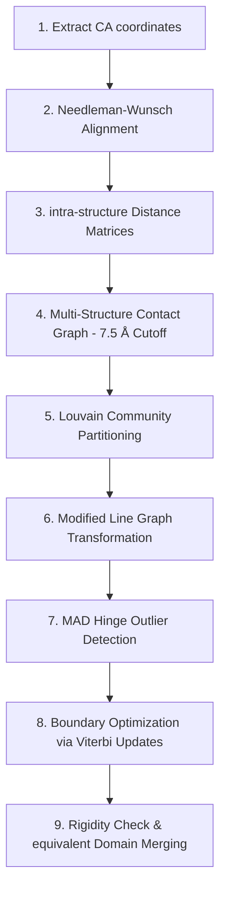

# Protein Domain Predictor

A high-performance, dark-themed Java Swing desktop application implementing the multi-conformation graph-based rigid domain decomposition workflow described by **Dang et al. (2021)**.

The tool identifies rigid structural domains and hinge boundaries by modeling proteins as contact graphs and using Louvain community partitioning, Line Graph variance mapping, Median Absolute Deviation (MAD) outlier detection, and Viterbi optimization.

---

## 🚀 Key Features

*   **Sleek Dark Theme UI**: Custom anti-aliased rounded widgets (`RoundButton` and `RoundTextField`) and charcoal cards with a clean modern layout.
*   **Step-wise Chain Auto-Detection**: Enter PDB IDs or select local files, and the app will scan the structures, detect all coordinates chain identifiers, and prompt you to select specific chains before running analysis.
*   **Interactive 2D Network Canvas**: Interactive circular layouts for pipeline stages. Hovering over nodes highlights edge paths and displays residue indexes, group memberships, and degrees.
*   **Interactive 3D Superposition Canvas**: Overlay multiple conformers (aligned via Kabsch algorithm) directly within the main window. Hovering over the trace displays conformer names, residue IDs, and predicted domain bounds.
*   **Algorithmic Optimization**: Louvain partitioning optimized from $O(N)$ community size scans to $O(1)$ size caching, delivering massive performance boosts.
*   **Zero Dependencies**: Written in pure Java Swing/AWT (no external Jars needed).

---

## 📁 Repository Structure

```
ProteinDomainPredictor/
├── data/                       # Local PDB cache directory
├── src/                        # Java source directory
│   ├── Analyzer.java           # Math core: Contact graph, Louvain, MAD, Viterbi
│   ├── GraphPanel.java         # Interactive 2D circular network graph renderer
│   ├── Main.java               # App entry point, Tabbed GUI, & rounded styles
│   ├── Residue.java            # C-alpha residue coordinates data model
│   ├── Structure.java          # Download manager and standard PDB coordinate parser
│   ├── Structure3DPanel.java   # Orbit-controlled orthographic 3D trace visualizer
│   └── Superposition.java      # Kabsch structural translation & alignment solver
├── logo.jpg                    # High-quality stylized app icon
├── README.md                   # Core project documentation
└── walkthrough.md              # Detailed final changes walkthrough
```

---

## 🛠️ Compilation & Execution

Since the project is built in pure Java without external dependencies, it compiles and runs out-of-the-box on any computer with Java Development Kit (JDK) installed.

### Standard Command Line

1. Open your terminal or PowerShell inside the `ProteinDomainPredictor` directory.
2. Compile the files:
   ```bash
   javac src/*.java
   ```
3. Run the application:
   ```bash
   java -cp src Main
   ```

### Running in Eclipse
1. Import the directory into Eclipse as a **Java Project**.
2. Right-click [`src/Main.java`](file:///c:/Users/Yash%20katekhaye/eclipse-workspace/ProteinDomainPredictor/src/Main.java) and select **Run As** > **Java Application**.

---

## 🧬 Algorithm Pipeline

The core analysis follows the multi-structure rigid domain pipeline:



1. **Alignment**: Sequences are aligned to map structural residue correspondences across conformations.
2. **Contact Graph**: Builds contacts with a 7.5 Å cutoff threshold, weighted by $exp(-variance)$ of distances.
3. **Partitioning**: Coarse-grains residues into communities using Louvain optimizations.
4. **Hinges**: Maps edges to nodes in a Line Graph and uses MAD outlier detection to flag high-variance hinge coordinates.
5. **Prediction**: Predicts boundary coordinates using local Viterbi update calculations, reporting final domains.

---

## 📝 Important Scientific Note

The published Dang et al. implementation is Python-based and depends on igraph, Louvain-igraph, and an external Java Viterbi executable JAR. 

This Java codebase is a compact, **dependency-free** reimplementation. Its graph calculations, distance variance modeling, line graphs, and outlier rules sets follow the reference closely. The pure-Java local label boundary optimizer is tailored to run locally without external executables, and provides equivalent structural domain boundary segmentation.

---

## 📚 References

*   **Dang TKL, Nguyen T, Habeck M, Gültas M, Waack S.**  
    *A graph-based algorithm for detecting rigid domains in protein structures.*  
    BMC Bioinformatics. 2021;22:66.  
    DOI: [10.1186/s12859-021-03966-3](https://doi.org/10.1186/s12859-021-03966-3)
