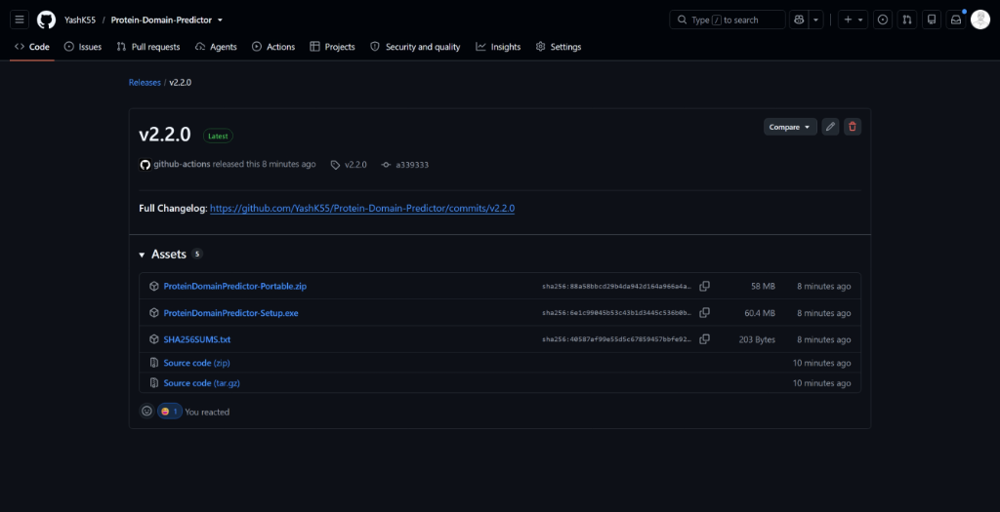
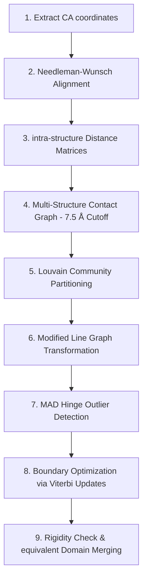

# Protein Domain Predictor

A high-performance, dual-themed (Light/Dark) Java Swing desktop application implementing the multi-conformation graph-based rigid domain decomposition workflow described by **Dang et al. (2021)**.

The tool identifies rigid structural domains and hinge boundaries by modeling proteins as contact graphs and using Louvain community partitioning, Line Graph variance mapping, Median Absolute Deviation (MAD) outlier detection, and Viterbi optimization.

---

## 💾 Installation

[](https://github.com/YashK55/Protein-Domain-Predictor/releases/latest)

### Option A: Windows Installer (Recommended)

**Step 1** — Go to the [**Releases**](https://github.com/YashK55/Protein-Domain-Predictor/releases/latest) page and download `ProteinDomainPredictor-Setup.exe`.

<p align="center">
  
</p>

**Step 2** — Run the downloaded `ProteinDomainPredictor-Setup.exe`.

> **⚠️ Windows SmartScreen Warning**
>
> Since the app is not code-signed, Windows may show a SmartScreen warning:
>
> 1. Click **"More info"** on the warning dialog
> 2. Click **"Run anyway"**
>
> This is expected for open-source software without a paid code-signing certificate.

**Step 3** — Follow the installer wizard:
   - Choose your installation directory (default: `C:\Program Files\Protein Domain Predictor\`)
   - Select whether to create a Start Menu shortcut and Desktop shortcut
   - Click **Install** and wait for the process to complete

**Step 4** — Launch **Protein Domain Predictor** from the Start Menu or Desktop shortcut.

---

### Option B: Portable Version (No Installation Required)

1. Download `ProteinDomainPredictor-Portable.zip` from [**Releases**](https://github.com/YashK55/Protein-Domain-Predictor/releases/latest)
2. Extract the ZIP to any folder
3. Open the extracted folder and run `Protein Domain Predictor.exe`

> **💡 Tip:** The portable version requires no installation and can run from a USB drive. No admin privileges needed.

---

### Option C: Verify Downloads (Optional)

Each release includes a `SHA256SUMS.txt` file for verifying download integrity:

```powershell
# PowerShell - verify the installer
(Get-FileHash ProteinDomainPredictor-Setup.exe -Algorithm SHA256).Hash
# Compare the output with the hash in SHA256SUMS.txt
```

---

### System Requirements

| Requirement | Minimum |
|------------|---------|
| **OS** | Windows 10 or later (64-bit) |
| **RAM** | 4 GB |
| **Disk** | ~200 MB (installed) |
| **Java** | Not required — bundled with the app via `jpackage` |

---

## 🛠️ Building from Source

For developers who want to compile and run from source code. Requires [JDK 17+](https://adoptium.net/).

### Standard Command Line

1. Open your terminal or PowerShell inside the `ProteinDomainPredictor` directory.
2. Compile the files:
   ```bash
   javac -d bin src/*.java
   ```
3. Run the application:
   ```bash
   java -cp bin Main
   ```

### Running in Eclipse
1. Import the directory into Eclipse as a **Java Project**.
2. Right-click `src/Main.java` and select **Run As** > **Java Application**.

### Building the Installer Locally
```bash
.\package.bat
```
This generates both the portable ZIP and Setup EXE in the `dist/` directory.

---

## 🚀 Key Features

*   **Dual Theme UI (Light/Dark Mode)**: Custom anti-aliased rounded widgets (`RoundedButton` and `RoundedTextField`) and responsive panels supporting seamless light and dark mode switching with high-contrast visualization canvases.
*   **Step-wise Chain Auto-Detection**: Enter PDB IDs or select local files, and the app will scan the structures, detect all common chain identifiers, and prompt you to select specific chains before running analysis.
*   **Interactive 2D Network Canvas**: Interactive circular layouts for pipeline stages. Hovering over nodes highlights edge paths and displays residue indexes, group memberships, and degree connectivity in real-time.
*   **Vector Icons Integration**: Native vector-drawn components (`ThemeIcon`, `ArrowIcon`, `StatusIcon`) to provide seamless resolution scalability without emoji dependencies.
*   **Algorithmic Optimization**: Louvain partitioning optimized from $O(N)$ community size scans to $O(1)$ size caching, delivering massive performance boosts.
*   **Zero External Dependencies**: Written in pure Java Swing/AWT (no external JARs needed).

---

## 📁 Repository Structure

```
ProteinDomainPredictor/
├── .github/workflows/          # CI/CD pipeline definitions
│   ├── ci.yml                  # Build & compile on every push/PR
│   └── release.yml             # Automated releases on version tags
├── data/                       # Local PDB cache directory
├── docs/images/                # Documentation screenshots
├── src/                        # Java source directory
│   ├── AboutPanel.java         # About & Changelog panel layout (GridBagLayout)
│   ├── AnalysisPanel.java      # Guided Analysis Panel
│   ├── Analyzer.java           # Math core: Contact graph, Louvain, MAD, Viterbi
│   ├── AppTheme.java           # Color modes, vector icons, & custom widgets
│   ├── ChainSelectionPanel.java# Inter-structure chain selection view
│   ├── GraphPanel.java         # Interactive 2D circular network graph renderer
│   ├── HomePanel.java          # Central home screen panel
│   ├── Main.java               # App entry point, frame coordinator, & theme switcher
│   ├── PipelinePanel.java      # Left pipeline step navigation panel
│   ├── ProcessingPanel.java    # Progress loader panel with custom vector status icons
│   ├── Residue.java            # C-alpha residue coordinates data model
│   └── Structure.java          # Download manager and standard PDB coordinate parser
├── Logo.ico                    # Windows installer icon
├── Logo.png                    # High-quality app logo
├── package.bat                 # Windows packaging script
├── README.md                   # Core project documentation
└── walkthrough.md              # Detailed final changes walkthrough
```

---

## 🧬 Algorithm Pipeline

The core analysis follows the multi-structure rigid domain pipeline:



1. **Alignment**: Sequences are aligned to map structural residue correspondences across conformations.
2. **Contact Graph**: Builds contacts with a 7.5 Å cutoff threshold, weighted by $exp(-variance)$ of distances.
3. **Partitioning**: Coarse-grains residues into communities using Louvain optimizations.
4. **Hinges**: Maps edges to nodes in a Line Graph and uses MAD outlier detection to flag high-variance hinge coordinates.
5. **Prediction**: Predicts boundary coordinates using local Viterbi update calculations, reporting final domains.

---

## 📝 Important Scientific Note

The published Dang et al. implementation is Python-based and depends on igraph, Louvain-igraph, and an external Java Viterbi executable JAR. 

This Java codebase is a compact, **dependency-free** reimplementation. Its graph calculations, distance variance modeling, line graphs, and outlier rules sets follow the reference closely. The pure-Java local label boundary optimizer is tailored to run locally without external executables, and provides equivalent structural domain boundary segmentation.

---

## 📚 References

*   **Dang TKL, Nguyen T, Habeck M, Gültas M, Waack S.**  
    *A graph-based algorithm for detecting rigid domains in protein structures.*  
    BMC Bioinformatics. 2021;22:66.  
    DOI: [10.1186/s12859-021-03966-3](https://doi.org/10.1186/s12859-021-03966-3)
